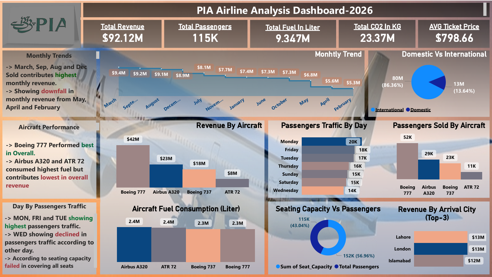

# ✈️ PIA Airline Analysis 2026

An interactive Business Intelligence dashboard built using Microsoft Power BI to analyze airline performance, revenue trends, passenger traffic, and operational efficiency.

---

##  Dashboard Preview

---

##  Project Overview

This project focuses on analyzing airline data to extract meaningful insights related to revenue, passengers, aircraft performance, and fuel consumption.

The dashboard helps stakeholders understand trends, identify high-performing areas, and make data-driven decisions.

---

## 📌 Key KPIs

- 💰 Total Revenue: $92.12M  
- 👥 Total Passengers: 115K  
- ⛽ Total Fuel Consumption: 9.34M Liters  
- 🌍 CO2 Emissions: 23.37M KG  
- 🎟️ Avg Ticket Price: $798.66  

---

## 📈 Key Insights

- 📅 Highest revenue months: March, September, August, December  
- 📉 Revenue decline observed in February, April, and May  
- ✈️ Boeing 777 is the top-performing aircraft  
- 🌐 Domestic travel dominates (~86%) compared to international (~14%)  
- 🪑 Seating capacity is not fully utilized in some cases  

---

## 📊 Features

- Monthly Revenue Trend Analysis  
- Aircraft Performance Comparison  
- Passenger Traffic by Day  
- Fuel Consumption Analysis  
- Revenue by Top Cities  
- Seating Capacity vs Passengers  
- Domestic vs International Distribution  

---

## 🛠️ Tools & Technologies

- Microsoft Power BI  
- DAX (Data Analysis Expressions)  
- Data Cleaning & Transformation  

---

## 📂 Dataset

The dataset includes airline-related information such as:
- Passenger count  
- Revenue data  
- Aircraft type  
- Fuel consumption  
- Flight routes  

*(Dataset is simulated for analysis purposes)*

---

## 🎯 Objective

To design a clean and interactive dashboard that:
- Provides business insights  
- Helps in decision-making  
- Demonstrates data visualization skills  

---

## 📸 How to Use

1. Download the `.pbix` file  
2. Open in Power BI Desktop  
3. Explore visuals and insights  

---

## 📌 Author

**Md Saleh**  
Aspiring Data Analyst  

---

## ⭐ If you like this project

Give it a ⭐ on GitHub and connect with me on LinkedIn! ( https://www.linkedin.com/in/md-saleh-163b44284/ )
